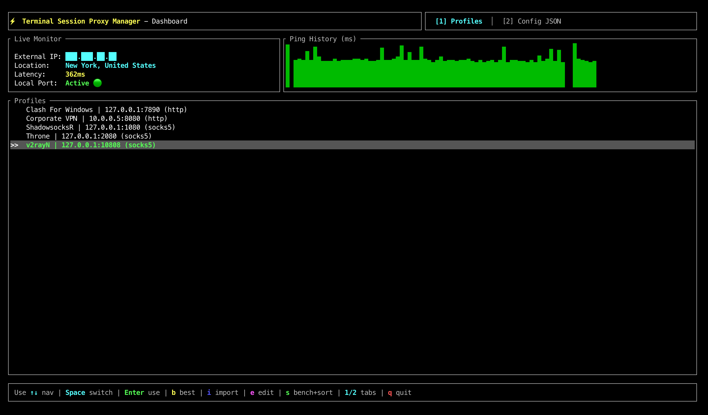

<p align="center">
  🇬🇧 <a href="README.md">English</a> | 🇷🇺 <b>Русский</b>
</p>

# ⚡ Terminal Session Proxy Manager


[](https://github.com/LebedevKondakovSergeyVach/Terminal-Session-Proxy-Manager/actions/workflows/ci.yml)
[](https://www.rust-lang.org)
[](LICENSE)
[](README.ru.md)


Управление прокси-профилями терминальной сессии одной командой, на **Rust**:
переключение профилей, замер задержки, диагностика соединения и контроль тех
переменных окружения, которые ваши инструменты действительно читают — на
**macOS** и **Linux** (Zsh / Bash).

## ✨ Возможности

- **Профили вместо экспортов.** Опишите прокси один раз и переключайтесь одной
  командой или через интерактивный выбор.
- **Интерактивный TUI-дашборд.** Текущий IP, геолокация, график задержки и
  переключение профилей на одном экране.
- **Автовыбор самого быстрого.** Параллельный замер всех профилей с выбором
  лучшего и автопереключением при отказе активного прокси.
- **Диагностика.** Замер задержки, проверка сокетов и реальный тест скорости.
- **Экспорт куда угодно.** Одна команда для Docker, cURL, Git, `.env` и
  JVM-сборок — с корректным экранированием для shell.
- **Два языка.** Полностью русский и английский интерфейс.



---

## ⚡ Быстрый старт

### 📦 Установка

**Homebrew (macOS / Linux):**

```bash
brew install LebedevKondakovSergeyVach/tap/terminal-session-proxy-manager
```

**Cargo** (требуется Rust 1.88+):

```bash
cargo install --git https://github.com/LebedevKondakovSergeyVach/Terminal-Session-Proxy-Manager.git
```

**Из исходников:**

```bash
git clone https://github.com/LebedevKondakovSergeyVach/Terminal-Session-Proxy-Manager.git
cd Terminal-Session-Proxy-Manager
cargo install --path .
```

### 🐚 Интеграция с shell

Программа не может изменить окружение запустившего её shell — этого не может ни
один процесс. Эту задачу решает shell-функция `proxy`, поэтому добавьте скрипт
инициализации в конфигурацию вашей оболочки:

**Zsh** (`~/.zshrc`):

```bash
eval "$(terminal-session-proxy-manager init zsh)"
```

**Bash** (`~/.bashrc`):

```bash
eval "$(terminal-session-proxy-manager init bash)"
```

Перезапустите терминал или выполните `source ~/.zshrc`. После этого станут
доступны `proxy on`, `proxy off`, `proxy switch` и автодополнение.

### Первый запуск

```bash
proxy profile set home --name "Домашний" --host 127.0.0.1 --port 1080
proxy on
proxy status
```

---

## 🚀 Команды

Всё, что меняет текущую сессию, работает через функцию `proxy`; остальные
команды доступны и по полному имени бинарника.

### Сессия

| Команда | Описание |
| :--- | :--- |
| `proxy on` | Включить прокси для текущей сессии |
| `proxy off` | Выключить |
| `proxy status` | Состояние прокси, IPv4, IPv6 и геолокация |
| `proxy status --json` | То же самое в формате JSON |
| `proxy run -- <cmd>` | Выполнить одну команду через прокси, не меняя сессию |
| `proxy prompt` | Индикатор для строки приглашения (`PS1` / `PROMPT`) |

### Профили

| Команда | Описание |
| :--- | :--- |
| `proxy profile list` | Список всех профилей |
| `proxy switch` | Интерактивный выбор стрелками |
| `proxy use <ключ>` | Переключиться на профиль по ключу |
| `proxy profile set <ключ> [--name N] [--host H] [--port P] [--protocol P]` | Добавить или изменить профиль |
| `proxy profile remove <ключ>` | Удалить профиль |
| `proxy import <источник>` | Импорт профилей из JSON-файла или URL подписки |

### Измерения

| Команда | Описание |
| :--- | :--- |
| `proxy dash` | Интерактивный TUI-дашборд |
| `proxy benchmark` | Задержка и доступность всех профилей |
| `proxy best` | Замерить и переключиться на самый быстрый |
| `proxy ping [--timeout МС]` | Задержка до эндпоинтов из `config.json` |
| `proxy speedtest` | Реальная скорость загрузки |
| `proxy monitor` | Проверка состояния с автопереключением |
| `proxy diagnose` | Диагностика сокетов и эндпоинтов |

### Интеграции

| Команда | Описание |
| :--- | :--- |
| `proxy git <on\|off\|status>` | Глобальные настройки прокси в Git |
| `proxy export <docker\|curl\|envfile>` | Экспорт настроек для других инструментов |
| `proxy env <on\|off>` | Вывести сырые shell-команды (то, что выполняет `proxy on`) |
| `... init <zsh\|bash>` | Вывести скрипт интеграции с shell |
| `... completions <zsh\|bash\|fish\|powershell>` | Вывести скрипт автодополнения |

### Конфигурация

| Команда | Описание |
| :--- | :--- |
| `proxy config path` | Путь к активному `config.json` |
| `proxy config show` | Показать текущую конфигурацию |
| `proxy settings path` | Путь к `settings.json` |
| `proxy settings show` | Показать глобальные настройки |
| `proxy lang <ru\|en>` | Переключить язык интерфейса |
| `proxy debug <on\|off>` | Отладочный лог shell-интеграции |

### Глобальные опции

Доступны для любой подкоманды.

| Опция | Переменная окружения | Назначение |
| :--- | :--- | :--- |
| `--config-file <ПУТЬ>` | `TSPM_CONFIG` | Использовать конкретный `config.json` |
| `--settings-file <ПУТЬ>` | `TSPM_SETTINGS` | Использовать конкретный `settings.json` |
| `--lang <ru\|en>` | `TSPM_LANG` | Язык только для этого запуска |

Переменная `NO_COLOR` учитывается. Удобно для разделения нескольких наборов
настроек:

```bash
TSPM_CONFIG=~/work-proxies.json proxy best
```

---

## ⚙️ Конфигурация

Два файла, оба в формате JSON:

- **`config.json`** — профили и эндпоинты для проверок.
- **`settings.json`** — язык интерфейса и необязательный путь к конфигурации.

Оба располагаются в системном каталоге конфигурации
(`~/Library/Application Support/terminal-session-proxy-manager` на macOS,
`~/.config/terminal-session-proxy-manager` на Linux). Точный путь покажет
`proxy config path`.

Порядок разрешения `config.json`: `--config-file` → `TSPM_CONFIG` →
`config_path` из `settings.json` → системный каталог конфигурации.

Если файл конфигурации существует, но содержит некорректный JSON, программа
**сообщит об этом и не тронет файл** — он никогда не перезаписывается
значениями по умолчанию.

Полная схема — в [`docs/CONFIGURATION.ru.md`](docs/CONFIGURATION.ru.md), готовый
пример — в [`configs/config.default.json`](configs/config.default.json).

---

## 📚 Документация

- [📦 **Установка**](docs/INSTALLATION.ru.md) — сборка и настройка PATH
- [🐚 **Интеграция с shell**](docs/SHELL_INTEGRATION.ru.md) — Zsh, Bash и строка приглашения
- [⚙️ **Конфигурация**](docs/CONFIGURATION.ru.md) — полная схема `config.json` и `settings.json`
- [📖 **Справочник команд**](docs/USAGE.ru.md) — все подкоманды и флаги
- [🤝 **Участие в разработке**](CONTRIBUTING.md) · [🔒 **Безопасность**](SECURITY.md) · [📝 **История изменений**](CHANGELOG.md)

---

## 📄 Лицензия

[GNU AGPLv3](LICENSE)
