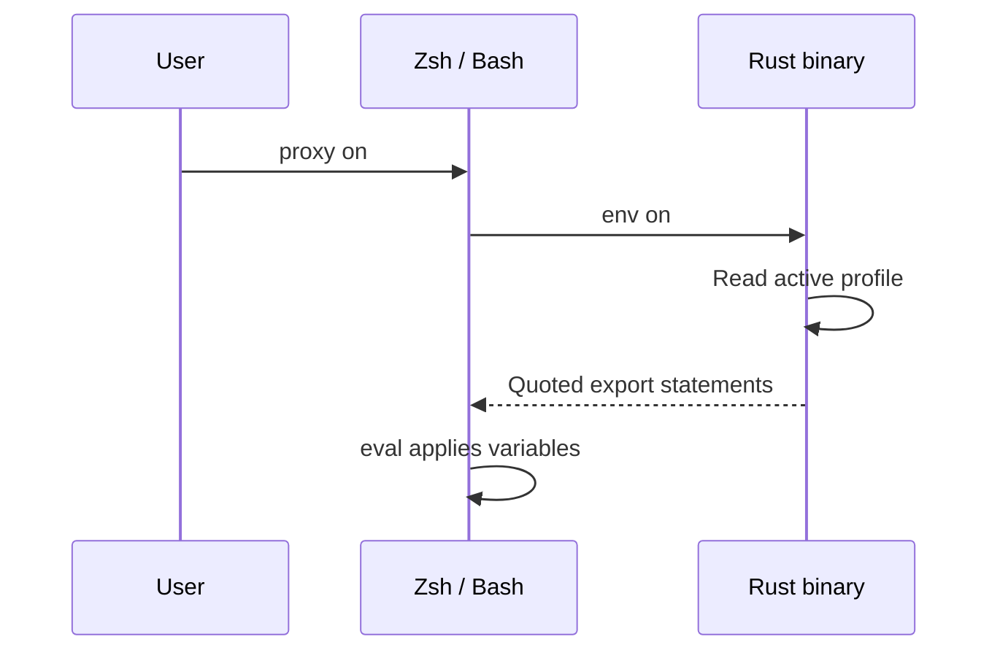
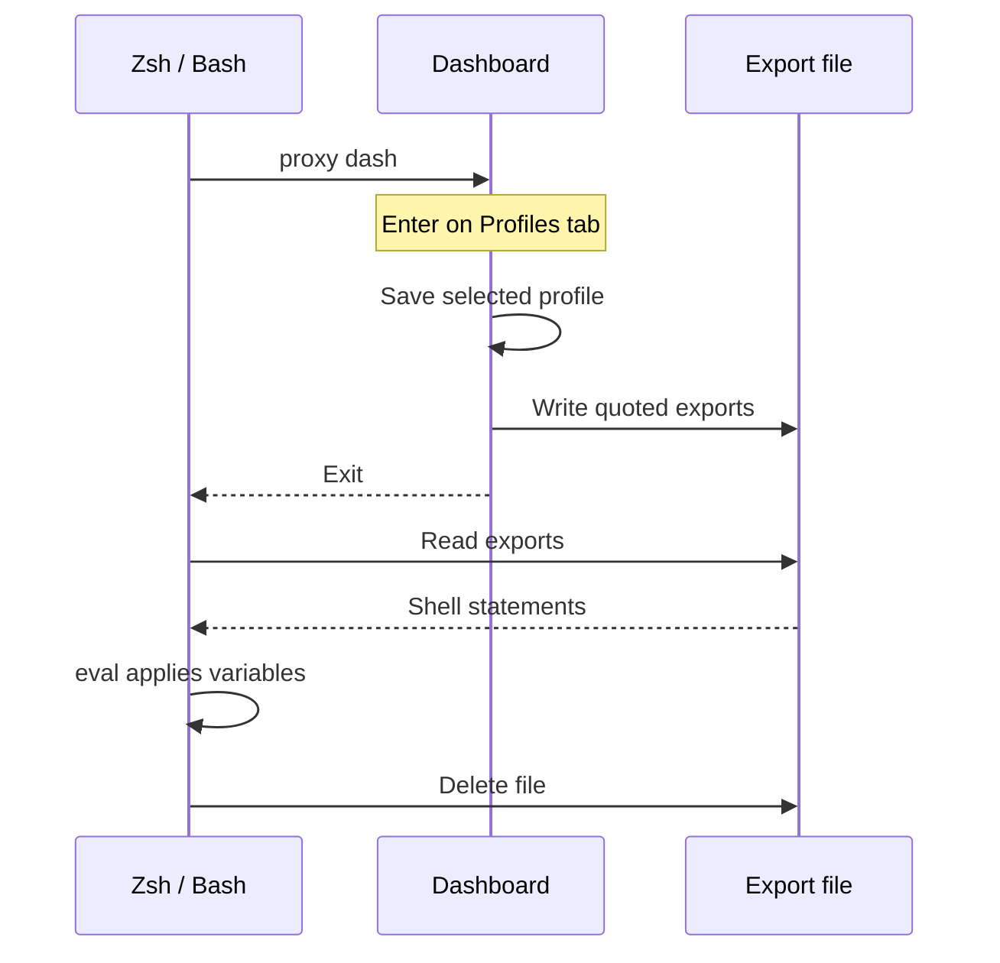

# 🐚 Shell Integration

A process cannot change the environment of the shell that started it. The
`proxy` shell function bridges that gap: it calls the binary, then evaluates
what the binary printed. Without it, `proxy on` cannot affect your session.

## Setup

<!--site:steps-->

1. **Add the init script to Zsh** (`~/.zshrc`):
   ```zsh
   eval "$(terminal-session-proxy-manager init zsh)"
   ```

2. **Or to Bash** (`~/.bashrc`):
   ```bash
   eval "$(terminal-session-proxy-manager init bash)"
   ```

3. **Restart your terminal** or `source` the file. This also installs tab
   completion, so a separate `completions` step is unnecessary.

<!--site:/steps-->

> Compatible with Powerlevel10k instant prompt — nothing is printed at startup.

If you would rather not run a command at shell startup, copy
[`shell/terminal-session-proxy-manager.zsh`](../shell/terminal-session-proxy-manager.zsh)
or [`.bash`](../shell/terminal-session-proxy-manager.bash) and source it. Those
files are generated from `init`, but the `eval` form can never go stale.

---

## How it works

<!--site:aside type="note"-->
A background process cannot modify its parent shell's environment. This is why running the binary directly cannot export variables into your active session.
<!--site:/aside-->

For `proxy on`, the shell function calls `terminal-session-proxy-manager env on`.
The binary reads the active profile and prints quoted `export` statements;
the function evaluates that output in the current Zsh or Bash session:



New commands inherit these variables. `proxy off` follows the same path with
`env off` and evaluates `unset` statements instead.

---

## What you get <!--site:badge text="Core" variant="tip"-->

The `proxy` function forwards anything it does not handle itself to the binary,
so `proxy <anything>` works.

| Command | Description |
| :--- | :--- |
| `proxy on` | Enable the proxy for this shell |
| `proxy off` | Disable it |
| `proxy use <key>` | Switch profile and re-apply if the proxy is on |
| `proxy switch` | Interactive picker, then re-apply |
| `proxy best` | Switch to the fastest profile, then re-apply |
| `proxy <other>` | Anything else, passed through to the binary |

For `proxy use`, `proxy switch` and `proxy best`, re-application happens only
after successful selection and when `ALL_PROXY` is nonempty. The function first
saves the selection through the binary, then calls `env on` and evaluates its
output. If `ALL_PROXY` is empty, selection is saved for the next `proxy on`.
`proxy profile use <key>` only saves the selection; use `proxy on` to apply it
to your shell.

Plus these standalone functions:

| Function | Description |
| :--- | :--- |
| `proxy_on` / `proxy_off` | Same as `proxy on` / `proxy off` |
| `proxy_toggle` | Flip the proxy on or off |
| `proxy_status` | Network status |
| `proxy_ping` | Latency to configured endpoints |
| `proxy_diagnose` | Socket and endpoint diagnostics |
| `proxy_benchmark` | Benchmark every profile |
| `proxy_best` | Switch to the fastest |
| `proxy_switch` | Interactive picker |
| `proxy_dash` | Dashboard, applying the chosen profile on exit |
| `proxy_run <cmd>` | Run one command through the proxy |
| `prompt_proxy_status` | Prompt indicator (Zsh only) |

Note the underscore in `proxy_toggle`: it is a separate function, not a
subcommand of `proxy`.

---

## Prompt indicator

Show the active proxy in your prompt. Zsh:

```zsh
setopt PROMPT_SUBST
RPROMPT='$(terminal-session-proxy-manager prompt)'
```

Bash:

```bash
PS1='$(terminal-session-proxy-manager prompt)'"$PS1"
```

It prints nothing when no proxy is set, so your prompt is unchanged while the
proxy is off.

---

## How `proxy dash` updates your shell

On the Profiles tab, `Enter` saves the selected profile, writes quoted export
statements to `~/.terminal-session-proxy-manager-eval`, and exits the dashboard.
The `proxy` or `proxy_dash` shell function then evaluates that file and deletes it:



`Space` saves the selected profile while keeping the dashboard open; it does
not write exports for the shell. The environment is applied after exiting
with `Enter`.

This only works through the shell function. Running the bare binary leaves the
file in place and your session unchanged.

If it does not work, turn on logging:

```bash
proxy debug on
proxy dash
cat ~/.terminal-session-proxy-manager-debug.log
proxy debug off
```

---

## Troubleshooting

**`proxy: command not found`** — the init line is missing from your rc file, or
you have not reloaded it. Check with `type proxy`.

**`terminal-session-proxy-manager binary not found in PATH`** — the function is
installed but the binary is not on `PATH`. See
[INSTALLATION.md](INSTALLATION.md).

**`proxy on` runs but tools ignore the proxy** — confirm with
`proxy diagnose`, which prints the main proxy variables set in your session
(`env | grep -i proxy` shows all of them). Note that variables are not inherited
by shells that were already open.
