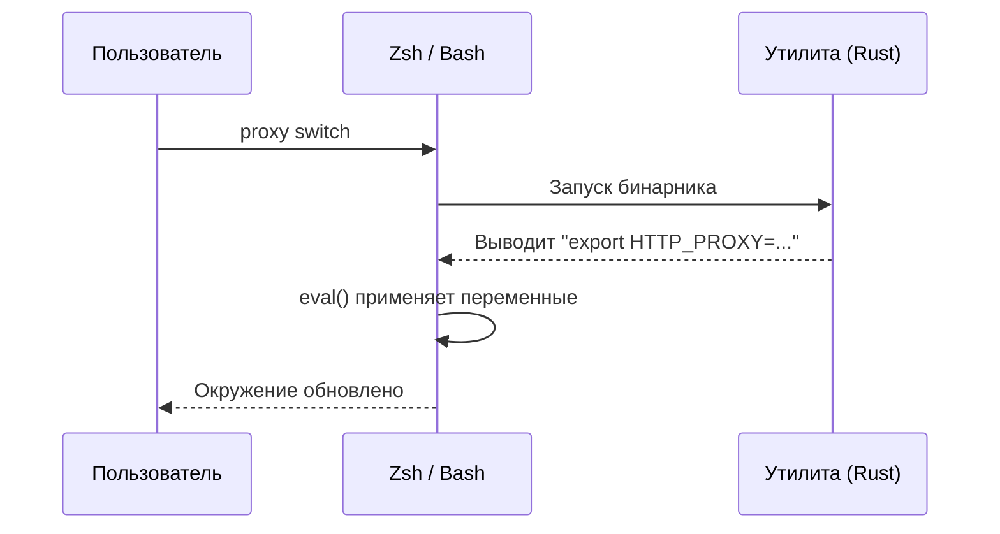

import { Steps, Badge, Aside } from '@astrojs/starlight/components';


Процесс не может изменить окружение оболочки (shell), которая его запустила.
Shell-функция `proxy` устраняет это ограничение: она вызывает бинарник, а затем
выполняет (через `eval`) то, что бинарник вывел. Без этой функции `proxy on`
не сможет изменить вашу сессию.

## Установка

<Steps>

1. **Добавьте скрипт в Zsh** (`~/.zshrc`):
   ```zsh
   eval "$(terminal-session-proxy-manager init zsh)"
   ```

2. **Или в Bash** (`~/.bashrc`):
   ```bash
   eval "$(terminal-session-proxy-manager init bash)"
   ```

3. **Перезапустите терминал** или выполните `source` файла. Команда также
   устанавливает автодополнение (tab completion), так что отдельный шаг для
   `completions` не требуется.

</Steps>

> Совместимо с instant prompt в Powerlevel10k — при запуске ничего не печатается.

Если вы не хотите выполнять команду при старте оболочки, скопируйте
[`shell/terminal-session-proxy-manager.zsh`](https://github.com/LebedevKondakovSergeyVach/Terminal-Session-Proxy-Manager/blob/main/shell/terminal-session-proxy-manager.zsh)
или [`.bash`](https://github.com/LebedevKondakovSergeyVach/Terminal-Session-Proxy-Manager/blob/main/shell/terminal-session-proxy-manager.bash) и подключите через
`source`. Эти файлы сгенерированы из `init`, но форма с `eval` не устаревает
никогда.

---

## Как это работает

<Aside type="note">
Фоновый процесс не может изменить окружение запустившей его оболочки. Именно поэтому прямой запуск бинарника не позволяет экспортировать переменные в вашу активную сессию.
</Aside>

Чтобы решить эту проблему, shell-функция `proxy` выступает оберткой над Rust-бинарником:



Это гарантирует, что переменные окружения сразу же применяются в вашем текущем терминале.

---

## Что вы получаете <Badge text="Ядро" variant="tip" />

Функция `proxy` пробрасывает бинарнику всё, что не обрабатывает сама, поэтому
вызовы вроде `proxy <что-угодно>` работают как ожидается.

| Команда | Описание |
| :--- | :--- |
| `proxy on` | Включить прокси для этой сессии |
| `proxy off` | Выключить |
| `proxy use <ключ>` | Сменить профиль и переприменить, если прокси включён |
| `proxy switch` | Интерактивный выбор с переприменением |
| `proxy best` | Переключиться на самый быстрый с переприменением |
| `proxy <другое>` | Всё остальное передаётся бинарнику |

Дополнительно доступны отдельные функции:

| Функция | Описание |
| :--- | :--- |
| `proxy_on` / `proxy_off` | То же, что `proxy on` / `proxy off` |
| `proxy_toggle` | Переключить прокси вкл/выкл |
| `proxy_status` | Состояние сети |
| `proxy_ping` | Задержка до настроенных эндпоинтов |
| `proxy_diagnose` | Диагностика сокетов и эндпоинтов |
| `proxy_benchmark` | Замер всех профилей |
| `proxy_best` | Переключиться на самый быстрый |
| `proxy_switch` | Интерактивный выбор |
| `proxy_dash` | Дашборд с применением выбранного профиля при выходе |
| `proxy_run <cmd>` | Выполнить одну команду через прокси |
| `prompt_proxy_status` | Индикатор для строки приглашения (только Zsh) |

Обратите внимание на подчёркивание в `proxy_toggle`: это отдельная функция, а не
подкоманда `proxy`.

---

## Индикатор в строке приглашения

Показ активного прокси в приглашении. Zsh:

```zsh
setopt PROMPT_SUBST
RPROMPT='$(terminal-session-proxy-manager prompt)'
```

Bash:

```bash
PS1='$(terminal-session-proxy-manager prompt)'"$PS1"
```

Когда прокси не задан, ничего не выводится, поэтому при выключенном прокси
приглашение не меняется.

---

## Как `proxy dash` обновляет сессию

Нажатие `Enter` в дашборде записывает команды экспорта в файл
`~/.terminal-session-proxy-manager-eval`. Функция `proxy_dash` выполняет этот
файл после завершения бинарника и удаляет его.

Это работает только через shell-функцию. Прямой запуск бинарника оставит файл на
месте, а сессия не изменится.

Если не работает, включите логирование:

```bash
proxy debug on
proxy dash
cat ~/.terminal-session-proxy-manager-debug.log
proxy debug off
```

---

## Решение проблем

**`proxy: command not found`** — строка инициализации отсутствует в rc-файле или
файл не перечитан. Проверьте через `type proxy`.

**`terminal-session-proxy-manager binary not found in PATH`** — функция
установлена, но бинарник недоступен в `PATH`. См.
[INSTALLATION.ru.md](/Terminal-Session-Proxy-Manager/ru/installation/).

**`proxy on` отрабатывает, но инструменты игнорируют прокси** — проверьте через
`proxy diagnose`, который печатает переменные, реально установленные в сессии.
Учтите, что уже открытые оболочки эти переменные не наследуют.

