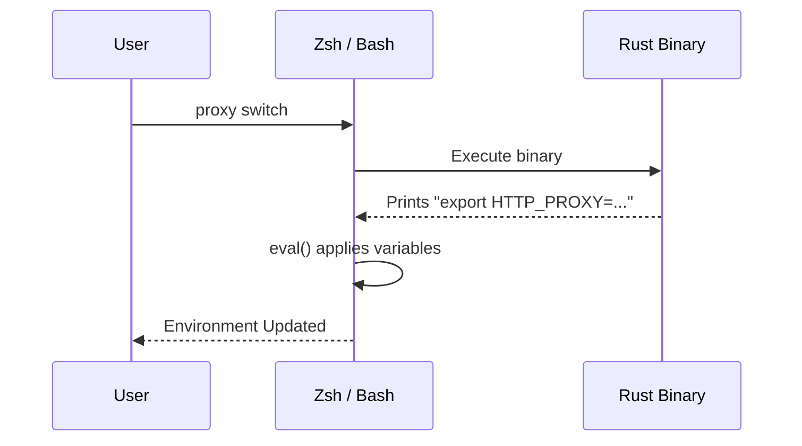

import { Steps, Badge, Aside } from '@astrojs/starlight/components';


A process cannot change the environment of the shell that started it. The
`proxy` shell function bridges that gap: it calls the binary, then evaluates
what the binary printed. Without it, `proxy on` cannot affect your session.

## Setup

<Steps>

1. **Add the init script to Zsh** (`~/.zshrc`):
   ```zsh
   eval "$(terminal-session-proxy-manager init zsh)"
   ```

2. **Or to Bash** (`~/.bashrc`):
   ```bash
   eval "$(terminal-session-proxy-manager init bash)"
   ```

3. **Restart your terminal** or `source` the file. This also installs tab
   completion, so a separate `completions` step is unnecessary.

</Steps>

> Compatible with Powerlevel10k instant prompt — nothing is printed at startup.

If you would rather not run a command at shell startup, copy
[`shell/terminal-session-proxy-manager.zsh`](https://github.com/LebedevKondakovSergeyVach/Terminal-Session-Proxy-Manager/blob/main/shell/terminal-session-proxy-manager.zsh)
or [`.bash`](https://github.com/LebedevKondakovSergeyVach/Terminal-Session-Proxy-Manager/blob/main/shell/terminal-session-proxy-manager.bash) and source it. Those
files are generated from `init`, but the `eval` form can never go stale.

---

## How it works

<Aside type="note">
A background process cannot modify its parent shell's environment. This is why running the binary directly cannot export variables into your active session.
</Aside>

To solve this, the `proxy` shell function wraps the Rust binary:



This ensures that your terminal session receives the environment variables immediately.

---

## What you get <Badge text="Core" variant="tip" />

The `proxy` function forwards anything it does not handle itself to the binary,
so `proxy <anything>` works.

| Command | Description |
| :--- | :--- |
| `proxy on` | Enable the proxy for this shell |
| `proxy off` | Disable it |
| `proxy use <key>` | Switch profile and re-apply if the proxy is on |
| `proxy switch` | Interactive picker, then re-apply |
| `proxy best` | Switch to the fastest profile, then re-apply |
| `proxy <other>` | Anything else, passed through to the binary |

Plus these standalone functions:

| Function | Description |
| :--- | :--- |
| `proxy_on` / `proxy_off` | Same as `proxy on` / `proxy off` |
| `proxy_toggle` | Flip the proxy on or off |
| `proxy_status` | Network status |
| `proxy_ping` | Latency to configured endpoints |
| `proxy_diagnose` | Socket and endpoint diagnostics |
| `proxy_benchmark` | Benchmark every profile |
| `proxy_best` | Switch to the fastest |
| `proxy_switch` | Interactive picker |
| `proxy_dash` | Dashboard, applying the chosen profile on exit |
| `proxy_run <cmd>` | Run one command through the proxy |
| `prompt_proxy_status` | Prompt indicator (Zsh only) |

Note the underscore in `proxy_toggle`: it is a separate function, not a
subcommand of `proxy`.

---

## Prompt indicator

Show the active proxy in your prompt. Zsh:

```zsh
setopt PROMPT_SUBST
RPROMPT='$(terminal-session-proxy-manager prompt)'
```

Bash:

```bash
PS1='$(terminal-session-proxy-manager prompt)'"$PS1"
```

It prints nothing when no proxy is set, so your prompt is unchanged while the
proxy is off.

---

## How `proxy dash` updates your shell

`Enter` in the dashboard writes the export statements to
`~/.terminal-session-proxy-manager-eval`. The `proxy_dash` function evaluates
that file after the binary exits, then deletes it.

This only works through the shell function. Running the bare binary leaves the
file in place and your session unchanged.

If it does not work, turn on logging:

```bash
proxy debug on
proxy dash
cat ~/.terminal-session-proxy-manager-debug.log
proxy debug off
```

---

## Troubleshooting

**`proxy: command not found`** — the init line is missing from your rc file, or
you have not reloaded it. Check with `type proxy`.

**`terminal-session-proxy-manager binary not found in PATH`** — the function is
installed but the binary is not on `PATH`. See
[INSTALLATION.md](/Terminal-Session-Proxy-Manager/installation/).

**`proxy on` runs but tools ignore the proxy** — confirm with
`proxy diagnose`, which prints the variables actually set in your session. Note
that variables are not inherited by shells that were already open.

